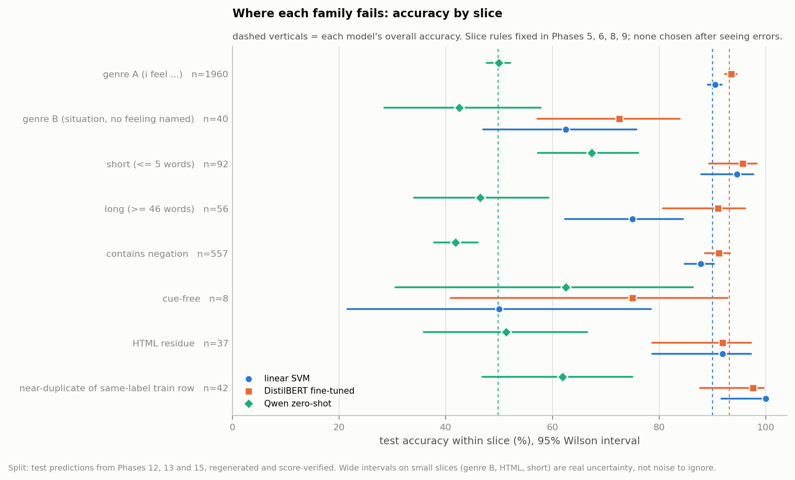

# Phase 17 — Error Analysis

CRISP-DM Phase 17 of 18.

**SPLIT USED: test predictions only.** Nothing is fitted, tuned or selected. Per-row
predictions for all six models are gathered in
`data/processed/test_predictions_all.parquet`.

Artefacts: `src/phase17_dump_predictions.py`, `src/phase17_errors.py`,
`reports/metrics/phase17_errors.json`, `reports/figures/fig14_error_slices.png`.

---

## 17.1 Getting trustworthy per-row predictions

Phases 13 and 14 saved confusion matrices and the full log of unparseable outputs,
but **not per-row predictions**, and error analysis needs them. They were regenerated
with the identical saved configuration: same model, prompt, examples, greedy decoding,
batch size 32 and row order. The classical models were re-predicted from their saved,
frozen model files.

The script refuses to continue unless every regenerated score **equals** the reported
one:

| Model | Regenerated macro F1 | Reported | Match |
|---|---:|---:|---|
| linear SVM | 0.8579 | 0.8579 | exact |
| logistic regression | 0.8486 | 0.8486 | exact |
| LightGBM | 0.8400 | 0.8400 | exact |
| DistilBERT fine-tuned | 0.8978 | 0.8978 | exact |
| Qwen zero-shot (regenerated on GPU) | 0.4107 | 0.4107 | exact |
| Qwen few-shot (regenerated on GPU) | 0.3427 | 0.3427 | exact |

Every result in this phase is therefore an analysis of the exact predictions that
produced the Phase 16 table.

## 17.2 How the slices were chosen

Every slice is defined by a rule fixed in an earlier phase, computed from the text or
from `train_clean`. No slice was invented after reading the errors:

| Slice | Rule | Origin |
|---|---|---|
| genre A / genre B | first-person opener + feel-word / everything else | Phase 6 |
| short / long | ≤ 5 words / ≥ 46 words (upper Tukey fence) | Phase 6 |
| cue-free | no word from the 336-word cue lexicon built on `train_clean` | Phase 6 |
| HTML residue | `http`, `href`, `www` or `amp` as a token | Phase 8 |
| near-duplicate of a same-label train row | cosine ≥ 0.90 to a `train_clean` row with the same label | Phase 9 |
| conflicting copy | the same text appears elsewhere with a different label | Phase 5 |
| contains negation | explicit negator list, written before any error was read | Phase 10 limitation |

**Section 17.7 is the one exception, and it is labelled EXPLORATORY.** Its words were
chosen after reading the errors, so it generates a hypothesis rather than testing one.

Slices are small, so every accuracy carries a 95% Wilson interval. Comparisons between
the SVM and DistilBERT use McNemar's exact test within the slice.

## 17.3 Accuracy by slice

| Slice | n | Linear SVM | DistilBERT | Qwen zero-shot | Fixed / broke† | McNemar p |
|---|---:|---:|---:|---:|---:|---:|
| **All test rows** | 2,000 | 0.899 | **0.931** | 0.497 | 110 / 47 | 5.3 × 10⁻⁷ |
| genre A (i feel …) | 1,960 | 0.905 [0.89, 0.92] | **0.935** [0.92, 0.95] | 0.499 | 103 / 44 | 1.3 × 10⁻⁶ |
| genre B (no feeling named) | 40 | 0.625 [0.47, 0.76] | **0.725** [0.57, 0.84] | 0.425 | 7 / 3 | 0.344 |
| short (≤ 5 words) | 92 | 0.946 [0.88, 0.98] | 0.957 [0.89, 0.98] | 0.674 | 2 / 1 | 1.0 |
| **long (≥ 46 words)** | 56 | 0.750 [0.62, 0.84] | **0.911** [0.81, 0.96] | 0.464 | **11 / 2** | **0.023** |
| contains negation | 557 | 0.878 [0.85, 0.90] | 0.912 [0.89, 0.93] | 0.418 | 33 / 14 | 0.008 |
| cue-free | 8 | 0.500 | 0.750 | 0.625 | 3 / 1 | 0.63 |
| HTML residue | 37 | 0.919 | 0.919 | 0.513 | 0 / 0 | — |
| near-duplicate, same label | 42 | **1.000** [0.92, 1.00] | 0.976 | **0.619** | 0 / 1 | 1.0 |
| conflicting copy in raw train | 11 | 0.273 | 0.455 | 0.273 | 2 / 0 | 0.5 |
| conflicting copy in val | 3 | **0.000** | 0.333 | 0.333 | 1 / 0 | 1.0 |

† **Fixed** = SVM wrong, DistilBERT right. **Broke** = SVM right, DistilBERT wrong.

## 17.4 The registered predictions, one at a time

### P1 — Errors concentrate on joy ↔ love and fear ↔ surprise (Phases 5, 12): **confirmed for trained models; not for prompted ones**

| Model | Total errors | Unparseable | joy ↔ love | fear ↔ surprise | sadness ↔ anger | Share on the two ambiguous pairs |
|---|---:|---:|---:|---:|---:|---:|
| DistilBERT | 138 | 0 | 52 | 25 | 19 | **55.8%** |
| linear SVM | 201 | 0 | 59 | 22 | 31 | 40.3% |
| logistic regression | 219 | 0 | 65 | 20 | 32 | 38.8% |
| LightGBM | 238 | 0 | 73 | 16 | 33 | 37.4% |
| Qwen zero-shot | 1,005 | 143 | 211 | 2 | 124 | 21.2% |
| Qwen few-shot | 1,050 | 19 | 185 | 1 | 226 | 17.7% |

**The better a trained model is, the larger the share of its errors on the pairs
annotators disagree about.** The share rises from 37% (LightGBM) to 56% (DistilBERT).
Each improvement removes avoidable errors and leaves the ambiguous ones behind.

The prompted models break the pattern, and in an informative way. Their errors are
**spread everywhere**: formatting failures, `sadness ↔ anger` (226 for few-shot, the
"anger catch-all" of Phase 14), and almost no `fear ↔ surprise`, because they rarely
predict either class at all. **They fail for reasons unrelated to how difficult the
data is.**

### P2 — The pre-trained model's advantage is largest on genre B (Phase 6): **direction consistent, not established**

| | Genre A (n = 1,960) | Genre B (n = 40) |
|---|---:|---:|
| SVM accuracy | 0.905 | 0.625 |
| DistilBERT accuracy | 0.935 | 0.725 |
| **DistilBERT gain** | **+3.0 points** | **+10.0 points** |
| Fixed / broke | 103 / 44 | 7 / 3 |
| McNemar p | 1.3 × 10⁻⁶ | **0.344** |

The gain on genre B is **three times the gain on genre A**, exactly the direction Phase
6 predicted. But genre B is only 40 test rows, and the difference is four rows net.
**It is not statistically distinguishable from chance** (p = 0.34), so it is reported
as consistent, not as confirmed.

Two further facts temper the reading:

- **Genre B is hard for every model.** The SVM loses 28 points relative to genre A,
  DistilBERT 21, Qwen 7. The pre-trained model degrades less, but it still degrades.
- **Genre B rows change hands in both directions.** They are 3.2× over-represented in
  the rows DistilBERT fixes *and* 3.2× in the rows it breaks. Genre B is volatile, not
  simply "where the pre-trained model wins".

The examples in §17.6 add a further caution: several genre-B rows that DistilBERT
"fixed" carry labels a careful reader would dispute. A gain on such rows may reflect
learning the conventions of that sub-population rather than world knowledge.

### P3 — Near-duplicates of a same-label training row are near-free points (Phase 9): **confirmed, with a clean control**

On the 42 test rows with a same-label near-duplicate in training, the **trained** models
score **97.6–100%**. **Qwen zero-shot, which never saw the training data, scores
61.9%.** The control isolates the mechanism: the near-perfect score comes from training
on the near-copy, not from the rows being intrinsically easy.

**But the effect on reported accuracy is small, and this corrects Phases 9 and 15.**
Those phases netted row *counts* — 2.10% near-copies minus 0.70% contradicted — and
concluded that "about 1.4 points" of accuracy was artefact. That is wrong, because a
90%-accurate model would have answered most near-copies correctly anyway. Measured from
per-row predictions against each model's accuracy on the 1,944 remaining rows:

| Model | Accuracy, clean rows | Near-copies (42) | Contradicted (14) | **Net effect on reported accuracy** |
|---|---:|---|---|---:|
| linear SVM | 0.9023 | 1.000 → +4.1 rows | 0.214 → −9.6 rows | **−0.28 points** |
| DistilBERT | 0.9336 | 0.976 → +1.8 rows | 0.429 → −7.1 rows | **−0.26 points** |
| Qwen zero-shot | 0.4964 | 0.619 → +5.2 rows | 0.286 → −2.9 rows | +0.11 points |

**The artefact rows slightly understate the trained models' clean-row accuracy, by about a
quarter of a point, and do so almost equally for both.** The model comparison is
unaffected. The Phase 9 and Phase 15 documents have been corrected.

### P4 — Any fine-tuned gain must come from what bag-of-words cannot see (Phase 10): **partly confirmed**

Phase 10 argued that a bag-of-words representation carries no compositional signal. So
if fine-tuning beats the SVM, the gain has to come from word order, negation scope or
world knowledge. Here is what each candidate shows:

| Candidate source of gain | Share of fixed rows vs base rate | Paired test | Verdict |
|---|---:|---|---|
| **Long documents (competing cues)** | **3.6×** in fixed, 1.5× in broken | fixed 11 / broke 2, **p = 0.023** | **supported** |
| Negation | 1.08× in fixed, 1.07× in broken | 33 / 14 — the same 2.4:1 ratio as overall | **not the source** |
| World knowledge (genre B) | 3.2× in fixed, 3.2× in broken | 7 / 3, p = 0.34 | **unresolved** |

**Long documents are where fine-tuning clearly helps.** On 56 documents of 46+ words,
the SVM scores 75.0% and DistilBERT 91.1%, a 16-point gap against 3 points overall.
Phase 6 flagged exactly this to check: long documents contain *more* cue words, and
"more cues can mean more *competing* cues". A bag-of-words model adds up every cue's
weight regardless of where it sits. A transformer can weigh a cue against its context —
which cue belongs to the writer, which is negated, which is reported speech. The
evidence fits that mechanism.

**Negation is not where the gain comes from.** It is common (557 rows, 28% of test) and
costs both models about two points. But DistilBERT fixes negation rows at exactly the
rate it fixes everything else: 33 fixed to 14 broken is the same 2.4:1 ratio as the
whole test set. The within-slice p = 0.008 reflects the general improvement, not a
negation-specific one. **The common assumption that transformers win by handling
negation is not supported on this benchmark.**

## 17.5 The hard core: 56 rows every trained model misses

**56 test rows (2.8%)** are misclassified by all four trained models: SVM, logistic
regression, LightGBM and DistilBERT.

- **57.1% sit on joy ↔ love or fear ↔ surprise.** The largest single pair is joy ↔ love,
  with 26 rows.
- True labels: joy 29, fear 12, sadness 10, anger 3, love 1, surprise 1.

Reading them is instructive. Six representative rows:

| True label | All four trained models say | Text |
|---|---|---|
| joy | love | *i could feel his breath on me and smell the sweet scent of him* |
| joy | love | *i feel very strongly about supporting charities that help children* |
| joy | love | *i never dreamed i would be so busy so soon in the new year but i am loving it and feeling so very gracious and fortunate* |
| anger | joy | *whenever i put myself in others shoes and try to make the person happy* |
| fear | anger | *i know what you mean about feeling agitated* |
| sadness | joy | *i feel i can only hope im not alone in these thoughts …* |

**This is the author's judgement, stated as such.** For most of these rows, the models'
answer is at least as defensible as the gold label. "The sweet scent of him" is
plausibly *love*. "Try to make the person happy" is not recognisably *anger*. "Feeling
agitated" sits on the anger/fear boundary. These are not failures of representation.
They are the irreducible ambiguity Phase 5 measured, and some are likely annotation
errors. **No model can be expected to score them, and no model should be credited or
blamed for them.**

## 17.6 What each family gets wrong, with real examples

### Linear SVM: keyword traps

Where the SVM fails and DistilBERT succeeds, the cause is often one misleading word, or a
word the SVM never learned:

| True | SVM | DistilBERT | Text |
|---|---|---|---|
| joy | sadness | joy | *made a **wonderfull** new friend* |
| joy | love | joy | *i have **nostalgic** feelings i have met wonderful people online …* |
| anger | love | anger | *i have no strong feelings for this book neither hated nor **loved** it* |

`wonderfull` is misspelled and has no TF-IDF column, so the SVM sees only `a made new
friend` — four features and **no emotion word at all** (verified against the fitted
vectorizer). DistilBERT's sub-word tokenizer splits the misspelling into pieces it knows. "Neither hated
nor loved" defeats a model that adds up the weights of `hated` and `loved`. Note that
some genre-B labels here, such as *anger* for that book review, are themselves
questionable (§17.4, P2).

### DistilBERT: what it breaks

The 47 rows DistilBERT gets wrong where the SVM was right follow the same label-boundary
lines:

| True | SVM | DistilBERT | Text |
|---|---|---|---|
| joy | joy | surprise | *i was gaining weight getting a lot stronger and feeling **amazing*** |
| sadness | sadness | anger | *i do feel **stressed*** |
| joy | joy | love | *i hope shes feeling **generous** today and treat me to japanese food …* |
| love | love | anger | *i feel very **mislead** by someone that i really really thought i knew and liked very much so* |

Each hinges on a word whose label is split in the training data. §17.7 measures that
directly.

### Qwen zero-shot: two failure modes, and one real strength

**Failure 1 — refusing the taxonomy** (143 unparseable outputs, Phase 13). The model
answers `stress`, `pain`, `anxiety` or `curiosity` instead of one of the six labels.

**Failure 2 — its own label boundaries.** It called 185 `joy` rows `love` and pushed
negative affect toward `sadness`, because it has never seen this dataset's conventions.

**The strength.** There are **14 rows where Qwen zero-shot is right and both the SVM and
DistilBERT are wrong**, and they show the one capability the trained models lack:

| True | SVM | DistilBERT | Qwen | Text |
|---|---|---|---|---|
| sadness | anger | anger | **sadness** | *i feel **hated** in cempaka* |
| sadness | anger | anger | **sadness** | *… this is just what i feel when i m around you guys i feel **hated*** |
| joy | surprise | surprise | **joy** | *i started walking again yesterday and it feels **amazing*** |
| sadness | joy | fear | **sadness** | *i feel **helpless** to regain a safe feeling* |
| sadness | anger | anger | **sadness** | *when i heard the last regulation of the socialist govrenment concerning pensions* (misspelling in original) |

**Being hated is sadness; hating is anger.** A model that keys on the word `hated` says
anger. A model that reads the construction "*I feel hated*" says sadness. The trained
models learned the keyword; the prompted model read the sentence. The pension-regulation
row is genre B, and Qwen is the only model that infers the emotion from the situation.

This is real compositional and world-knowledge competence, and it is exactly what Phase
10 said bag-of-words cannot provide. **But it covers 14 rows out of 2,000 (0.7%), inside a
model that gets 1,005 rows wrong.** The capability exists, and on this benchmark it is
swamped by the cost of not knowing the label conventions.

## 17.7 EXPLORATORY — words the annotations themselves split

*These words were chosen after reading the errors. This section generates a hypothesis;
it does not test one.*

The examples kept returning to a small set of words. So their label distribution was
measured **in the training annotations**, and set against each model's test accuracy on
rows containing them:

| Word | Train n | Training label split | Test n | SVM | DistilBERT |
|---|---:|---|---:|---:|---:|
| **agitated** | 103 | anger **51%** · fear **47%** | 13 | 0.46 | 0.54 |
| **passionate** | 108 | love **52%** · joy **44%** | 14 | 0.43 | 0.43 |
| **stressed** | 134 | sadness **52%** · anger **37%** | 20 | 0.30 | 0.50 |
| feel / be / get **hated** | 31 | anger 55% · sadness 45% | 3 | 0.00 | 0.00 |
| amazing | 116 | joy 56% · surprise 32% | 21 | 0.71 | 0.67 |
| hate / hated (any) | 228 | sadness 43% · anger 33% | 29 | 0.66 | 0.72 |
| *amazed (control)* | 70 | *surprise **94%*** | 9 | *0.78* | ***1.00*** |

**The annotators themselves split these words almost evenly between two labels.** In the
training data, `agitated` is anger in half its uses and fear in the other half.
`passionate` is love or joy with near-equal frequency. On rows containing these words,
**both models perform at roughly coin-flip level**, and more capacity does not help:
DistilBERT is no better than the SVM on `passionate`.

**The control sharpens the point.** `amazed`, which annotators labelled *surprise* 94% of
the time, is classified **perfectly** by DistilBERT. **A consistently labelled word is
learned. A word labelled inconsistently cannot be.**

**This closes the open item from Phase 12**, where `sadness ↔ anger` was the
second-largest SVM confusion (15.4%) and had not been predicted by annotator
disagreement. Its main carriers are `stressed` (sadness 52% / anger 37%) and `hated`
(split by construction: being hated reads as sadness, hating as anger). Both are split
in the training labels, so a lexical model cannot resolve them consistently.

The hypothesis for future work: **a substantial share of the residual error on this
benchmark is word-level annotation inconsistency**, and it is measurable directly from
the training labels without fitting any model.

## 17.8 The Phase 5 trap, observed directly

Phase 5 predicted that a test row with a **differently labelled copy in a model's own
training data** is guaranteed to be missed. It also removed such copies from
`train_clean`. The three test rows whose conflicting copy sits in **val** test this
exactly, because only some models trained on val:

| Model | Trained on val? | Accuracy on the 3 rows |
|---|---|---:|
| linear SVM | yes (train + val) | **0 / 3** |
| logistic regression | yes | **0 / 3** |
| LightGBM | yes | **0 / 3** |
| DistilBERT | no (val used only for early stopping) | 1 / 3 |

**Every model that trained on the conflicting copy missed all three.** The model that did
not train on it recovered one. The count is tiny, but the mechanism is exactly the one
Phase 5 described.

On the 11 test rows whose conflicting copy was in raw train, and so was **removed** from
`train_clean`, accuracy stays low: 27–55%. Removing the contradictory copy disarmed the
trap, but it did not make those texts answerable. They are genuinely ambiguous.

## 17.9 What Phase 17 establishes

1. **The fine-tuned model's gain over the SVM is broad, not concentrated.** It improves
   genre A (the template rows) at p = 1.3 × 10⁻⁶. Its clearest *specific* advantage is on
   **long documents** (+16 points, p = 0.023), where competing cues must be weighed
   against context.
2. **It is not a negation effect.** Negation rows improve at exactly the overall rate.
3. **Its advantage on genre B — situations with no feeling named — points the predicted
   way (+10 points) but is unestablished** on 40 rows.
4. **As trained models improve, their errors concentrate on annotation ambiguity**:
   55.8% of DistilBERT's errors lie on joy ↔ love or fear ↔ surprise, and the 56-row hard
   core is dominated by rows whose gold label is itself arguable.
5. **Exploratory: several cue words are split almost evenly between two labels in the
   training annotations themselves** (`agitated`, `passionate`, `stressed`, `hated`), and
   every model scores near chance on them. This explains the Phase 12 `sadness ↔ anger`
   confusion.
6. **The prompted LLM shows real compositional competence** — "feel hated" → sadness,
   "feels amazing" → joy, an emotion inferred from a pension regulation — **on 14 rows
   (0.7%)**, inside a model that misclassifies 1,005.
7. **Phases 5 and 9 are confirmed at the row level**: same-label near-duplicates are free
   points for trained models but not for zero-shot, and models that trained on a
   contradicting copy miss those rows.

---

## Summary of findings

1. **All six models' per-row test predictions reproduce their reported macro F1
   exactly**, including both Qwen configurations regenerated on the GPU.
2. Slice rules were fixed in Phases 5, 6, 8, 9 and 10. One exploratory section (§17.7) is
   labelled as such.
3. **P1 confirmed for trained models**: the share of errors on joy ↔ love plus
   fear ↔ surprise rises with model quality — LightGBM 37.4%, SVM 40.3%, DistilBERT
   55.8%. Prompted models' errors are spread elsewhere (Qwen few-shot: 226
   sadness ↔ anger).
4. **P2 consistent, not established**: DistilBERT's gain is +10.0 points on genre B
   against +3.0 on genre A, but n = 40 and McNemar p = 0.344. Genre B is volatile in both
   directions.
5. **P3 confirmed with a control**: trained models score 97.6–100% on same-label
   near-duplicates; Qwen zero-shot scores 61.9%.
6. **P4 partly confirmed**: the clearest specific gain is on **long documents** (SVM 75.0%
   → DistilBERT 91.1%; fixed 11 / broke 2; p = 0.023). **Negation is not the source** —
   fixed-to-broke ratio 33:14, identical to the overall 2.4:1.
7. **Hard core: 56 rows (2.8%) all trained models miss**, 57.1% on the two ambiguous
   pairs. By the author's reading, many gold labels are no more defensible than the models'
   answers.
8. **SVM failures are keyword traps**: a misspelling with no TF-IDF column
   (`wonderfull`), and "neither hated nor loved".
9. **Qwen zero-shot is right where both trained models are wrong on 14 rows**, through
   genuine composition ("I feel **hated**" → sadness) and inference from a situation —
   0.7% of test, against 1,005 errors.
10. **Exploratory: `agitated` (anger 51 / fear 47), `passionate` (love 52 / joy 44) and
    `stressed` (sadness 52 / anger 37) are split in the training labels**, and models
    score near chance on them. The consistently labelled `amazed` (94% surprise) scores
    100% under DistilBERT. This explains the Phase 12 `sadness ↔ anger` confusion.
11. **Phase 5 trap observed**: every model trained on val scored 0/3 on the rows whose
    conflicting copy is in val; DistilBERT, not trained on val, scored 1/3.
12. HTML residue costs nothing (SVM and DistilBERT both 91.9%), and short documents are
    easy (≈ 95%), confirming the Phase 6 and Phase 8 assessments.
