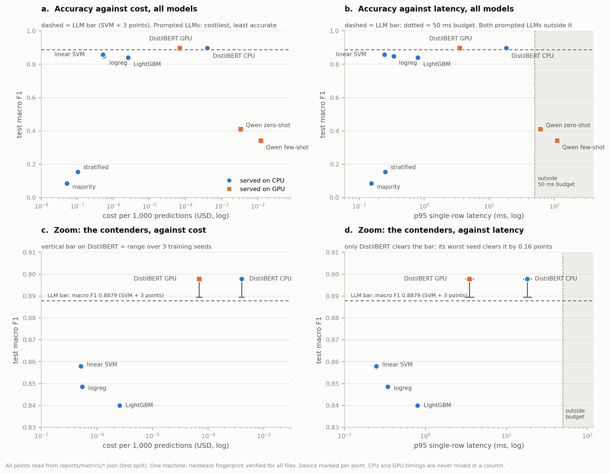

# Small Language Models versus Classical Machine Learning for Emotion Classification

### Accuracy, latency and cost on the Emotions Dataset for NLP

CMPE 255 — Data Science · Assignment 1 · Final report (CRISP-DM Phase 18)

---

## Abstract

We ask whether a small open-weight language model beats a classical machine-learning
model on a six-class emotion classification task, and whether any gain is worth its
extra latency and compute. Following CRISP-DM, we fixed a single train/validation/test
split, a primary metric (macro F1), and a decision rule before fitting any model: a
language model is *worth it* only if it beats the best classical model by at least 3
macro F1 points while keeping p95 single-row latency within 50 ms. Every model was timed
under one protocol, on one audited machine.

The answer depends sharply on how the language model is used. A **prompted** generative
model (Qwen2.5-1.5B-Instruct) loses badly: macro F1 0.411 zero-shot and 0.343 few-shot,
against 0.858 for a TF-IDF linear SVM. It also misses the latency budget (p95 61–110 ms)
and costs 6,557–23,803× more per prediction. Adding in-prompt examples made it *worse*,
and the result varied by 12 macro F1 points depending on which examples were drawn. A
**fine-tuned** pre-trained encoder (DistilBERT, 67 M parameters) wins: macro F1 0.898
(0.893 ± 0.004 over three seeds) and accuracy 0.931. It stays inside the budget on GPU
(p95 3.5 ms) and on CPU (p95 18.3 ms). Its superiority is statistically established
(McNemar p = 5.3 × 10⁻⁷). Its margin over the 3-point threshold is probable (P = 0.85),
not certain. At one million messages a month, it costs $0.07 (GPU) to $0.40 (CPU) more
than the SVM, and avoids about 31,500 misclassifications.

Error analysis shows that the residual error is increasingly annotation ambiguity. In
the training labels themselves, several cue words are split almost evenly between two
emotions.

---

## 1. Introduction

### 1.1 The question

> For a multi-class text classification task, does a small open-weight LLM beat a
> classical ML model — and is it worth the extra latency and compute?

The question has two halves in deliberate tension. The first is about **quality**: does
a model pre-trained on internet-scale text extract more signal from a short utterance
than a bag-of-words model fitted to 16,000 labelled examples? The second is about
**systems**: what does any such gain cost? A sparse linear model answers in
microseconds from a few hundred kilobytes. A billion-parameter decoder needs gigabytes
of weights and a GPU. A study that reports accuracy alone cannot answer the question
that was asked. So accuracy and cost are treated here as co-equal outcomes.

### 1.2 Framing

We assume a realistic host application: **inline triage of short user messages**. Each
message is tagged with one emotion so it can be routed — angry and fearful messages
escalate to a human, sad ones enter a retention workflow. The framing fixes four
otherwise arbitrary choices. Each message gets one hard label, so top-k metrics are
irrelevant. The tail classes matter, so **macro F1** is primary. The user waits, so the
latency budget is **p95 ≤ 50 ms**. And the scale is **1,000,000 messages per month**,
the scale at which costs are read.

### 1.3 Contributions

1. A pre-registered, cost-aware comparison of **eight models across four families** —
   naive baselines, three classical models, a prompted decoder LLM (zero- and
   few-shot), and a fine-tuned encoder — on one frozen split and one audited machine.
2. Evidence that **how a language model is used matters more than its size**. A 67 M
   fine-tuned encoder beats a 1.5 B prompted decoder by 48.7 macro F1 points, and is 17×
   faster on the same GPU.
3. A demonstration that **few-shot prompting with randomly drawn examples transmits label
   noise**. It is extremely sensitive to which examples are chosen, and here it performs
   below zero-shot.
4. A characterisation of the benchmark that bounds every claim: a **templated corpus**,
   a small **second text genre**, **HTML residue**, near-duplicate and contradictory
   rows across splits, and **word-level annotation inconsistency**.
5. A full record of **measurement defects found and corrected** during the study (§10).

---

## 2. Data

### 2.1 Dataset and split

The corpus is the Kaggle *Emotions dataset for NLP* (`praveengovi/emotions-dataset-for-nlp`):
one `text;label` pair per line, with six labels. Its upstream provenance was not verified
for this study. Row counts and training label counts matched the specification exactly.

| Split | Rows | joy | sadness | anger | fear | love | surprise |
|---|---:|---:|---:|---:|---:|---:|---:|
| train | 16,000 | 5,362 | 4,666 | 2,159 | 1,937 | 1,304 | 572 |
| val | 2,000 | 704 | 550 | 275 | 212 | 178 | 81 |
| test | 2,000 | 695 | 581 | 275 | 224 | 159 | 66 |

The dataset's own split was **frozen before any modelling** and never re-drawn. Training
and tuning used `train` and `val` only; `test` was scored once per model. The class mix
is consistent across splits: the total variation distance between train and test is
0.015. The classes are imbalanced 9.4 : 1, so a constant `joy` predictor reaches 34.75%
accuracy but only 0.086 macro F1.

### 2.2 What the corpus is

Characterising the data before modelling shaped every later interpretation. Five
properties matter.

**It is pre-normalised.** The corpus contains exactly 27 characters: lowercase letters
and the space. The standard cleaning pipeline changes **0 of 20,000** rows, so no
cleaning transform was applied.

**It is templated.** 97.3% of documents contain *feel*, *feeling*, *feels* or *felt*, and
37.9% begin with *i feel* or *im feeling*. The dominant form is *i feel ‹adjective›*.
Across all classes, the distinctive words (by log-odds with an informative Dirichlet
prior) are **emotion adjectives**. Association-rule mining shows that single adjectives
fix the label with near-certainty: `sympathetic` → love 54 of 54 times, `apprehensive` →
fear 58 of 58, `listless` → sadness 48 of 48. Word *pairs* add nothing over single words:
across 5,446 pairs, the mean confidence gain is −0.009. **This benchmark rewards lexical
lookup**, which favours bag-of-words models.

**It contains a second genre.** 2.8% of training rows do not report a feeling. They
describe the *situation* that caused one — *"when my father passed away"* → sadness —
with non-native phrasing and terse answers, in the style of a survey response. These
rows cannot be classified from a cue word; they need world knowledge. This is inferred
from style, not from documented provenance.

**It contains residue.** 1.7% of training rows contain HTML or URL tokens (`a href http
…`) left behind when punctuation was stripped. Character-level audits could not see
these. A clustering analysis found them.

**Its labels are inconsistent in measurable ways.** 51 of 52 repeated texts carry
*different* labels. That is consistent with de-duplication on the (text, label) pair.
Annotator collisions are strongly concentrated: joy ↔ love occurs 7.8× more often than
chance, and fear ↔ surprise 12.3×. Joy ↔ sadness, the *lexically* closest pair, never
collides.

### 2.3 Cleaning, and the validity of the test set

Cleaning touched **only the training data**: 77 rows (0.48%) were removed — 16 whose text
also appears in val or test, 60 carrying contradictory labels, and 1 redundant repeat.
`val` and `test` are byte-identical to the originals, so no cleaning choice can flatter
a result. The cleaned training set has 15,923 rows.

Two kinds of test row are not clean measurements of generalisation. **42 rows (2.1%)** are
near-duplicates (cosine ≥ 0.90) of a same-label training row. **14 rows (0.7%)** have a
differently labelled copy elsewhere. Measured from per-row predictions, their net effect
on reported accuracy is **−0.28 points for the linear SVM and −0.26 for DistilBERT**. It is
small, it slightly understates clean-row accuracy, and it is nearly identical across
models, so **model comparisons are unaffected**. (An earlier estimate of "+1.4 points" was
wrong; see §10.)

---

## 3. Methods

### 3.1 Process and pre-registration

The study followed the 18 CRISP-DM phases in order. Three things were fixed in Phase 1,
before any model existed:

- **Primary metric: macro F1**, with accuracy and all per-class F1 scores reported
  alongside.
- **Target: macro F1 ≥ 0.85** on test.
- **Decision rule: a language model is *worth it* only if its macro F1 exceeds the best
  classical model's by ≥ 0.03, *and* its p95 single-row latency is ≤ 50 ms.**

Several predictions were registered in intermediate phases before the corresponding
models were fitted. They are reported as confirmed, partly confirmed, or refuted (§5).

### 3.2 Measurement protocol

All models were scored through one shared harness.

- **Latency is end to end**, from a raw text string to a label string. It includes
  vectorisation, tokenisation, generation and parsing as applicable.
- **Single-row latency:** 20 warm-up runs discarded, then 200 timed runs cycling real test
  rows. p50, p95 and p99 are reported.
- **Batched throughput** is measured separately at batch sizes 1, 8, 32 and 128. A batch
  size that exceeds GPU memory is recorded as a result, not a crash.
- **Cost per 1,000 predictions** = (1000 / rows per second) / 3600 × hourly rate, with CPU
  at $0.192/h and GPU at $0.60/h. These rates are assumptions: ratios between models are
  robust, absolute dollars are not. The figure is compute only — a lower bound.
- **Model size** counts real files on disk, never symlinks. **Peak memory** is GPU peak
  allocation for GPU runs and process peak RSS for CPU runs; the two are not compared.

### 3.3 Hardware and reproducibility

Every metrics file carries a hardware block next to its numbers. A fingerprint of the
stable fields was frozen at the start, and **all 19 metrics files were audited against
it** before the comparison table was built.

| Field | Value |
|---|---|
| CPU | AMD Ryzen 7 7435HS, 8 cores / 16 threads |
| RAM | 15.3 GB |
| GPU | NVIDIA GeForce RTX 4060 Laptop GPU, 8,188 MiB |
| Driver / CUDA | 580.126.09 / 12.8 |
| PyTorch | 2.11.0+cu128 for every PyTorch-dependent timing |
| OS / Python | Linux 6.17 / 3.12.3 |

Seed 42 was used throughout. Exact package versions are pinned in `requirements.lock.txt`.

### 3.4 Models

| Family | Model | Trained on | Tuned / selected on | Device |
|---|---|---|---|---|
| Baseline | majority class; stratified random | train_clean | — | CPU |
| Classical | TF-IDF + logistic regression; + linear SVM; + LightGBM | train_clean + val | 5-fold stratified CV, macro F1 | CPU |
| Prompted LLM | Qwen2.5-1.5B-Instruct, zero-shot | — | nothing (fixed prompt) | GPU |
| Prompted LLM | Qwen2.5-1.5B-Instruct, few-shot | examples from train_clean | number of examples on val | GPU |
| Fine-tuned encoder | DistilBERT-base-uncased | train_clean | best epoch on val | GPU and CPU |

**Classical models.** The cross-validation grid encoded three questions raised by earlier
phases: unigrams versus bigrams, `min_df` 1 versus 2, and balanced class weights or none.
Each was decided by cross-validation, not asserted. All three models selected unigrams
and balanced class weights.

**Prompted LLM.** The prompt, greedy decoding and parser were fixed before any output was
seen. Parsing is **strict**: the whole output must equal one of the six labels. Anything
else is counted as an error, with no retries, repair or constrained decoding. Few-shot
examples were stratified across classes (seed 42), drawn from training rows with no
outlier flag; the number per class was chosen on val from {1, 2, 4}.

**Fine-tuned encoder.** DistilBERT was trained with class-weighted cross-entropy, AdamW
(learning rate 5 × 10⁻⁵), a linear schedule with 10% warm-up, at most 4 epochs, keeping
the best val macro F1, and maximum length 128 (the longest document is 87 WordPiece
tokens).

---

## 4. Results

### 4.1 Quality

Test split, scored once per model.

| Model | Macro F1 | Accuracy | joy | sadness | anger | fear | love | surprise |
|---|---:|---:|---:|---:|---:|---:|---:|---:|
| Majority class | 0.086 | 0.348 | 0.516 | 0.000 | 0.000 | 0.000 | 0.000 | 0.000 |
| Stratified random | 0.154 | 0.231 | 0.336 | 0.276 | 0.143 | 0.125 | 0.043 | 0.000 |
| TF-IDF + logistic regression | 0.849 | 0.891 | 0.916 | 0.929 | 0.890 | 0.860 | 0.791 | 0.706 |
| **TF-IDF + linear SVM** | **0.858** | **0.900** | 0.927 | 0.935 | 0.896 | 0.864 | 0.811 | 0.714 |
| TF-IDF + LightGBM | 0.840 | 0.881 | 0.901 | 0.926 | 0.873 | 0.863 | 0.742 | 0.736 |
| Qwen2.5-1.5B zero-shot | 0.411 | 0.498 | 0.567 | 0.625 | 0.501 | 0.322 | 0.295 | 0.154 |
| Qwen2.5-1.5B few-shot | 0.343 | 0.475 | 0.638 | 0.492 | 0.438 | 0.085 | 0.346 | 0.058 |
| **DistilBERT fine-tuned** | **0.898** | **0.931** | **0.948** | **0.970** | **0.932** | **0.888** | **0.853** | **0.795** |

The linear SVM is the best classical model, so the decision bar is **0.858 + 0.030 =
0.888**. Only DistilBERT clears it, and it beats the SVM on **every class**; its largest
gain is on the smallest class, `surprise` (+8.1 points). Its CPU (fp32) and GPU (bf16)
predictions agree on all 2,000 test rows.

### 4.2 Latency, throughput and cost

Timings are separated by the device each model actually ran on and are never mixed within
a column.

**Served on CPU**

| Model | Macro F1 | p50 ms | p95 ms | Rows/s (batch) | $ / 1,000 | $ / month at 1 M | Disk |
|---|---:|---:|---:|---:|---:|---:|---:|
| Linear SVM | 0.858 | 0.220 | **0.246** | 104,222 (128) | 5.12 × 10⁻⁷ | $0.0005 | 0.41 MB |
| Logistic regression | 0.849 | 0.313 | 0.341 | 98,489 (128) | 5.42 × 10⁻⁷ | $0.0005 | 0.81 MB |
| LightGBM | 0.840 | 0.665 | 0.800 | 20,781 (128) | 2.57 × 10⁻⁶ | $0.0026 | 2.69 MB |
| **DistilBERT fine-tuned** | **0.898** | 14.04 | **18.26** | 133 (8) | 4.02 × 10⁻⁴ | **$0.40** | 256 MB |

**Served on GPU**

| Model | Macro F1 | p50 ms | p95 ms | Rows/s (batch) | $ / 1,000 | $ / month at 1 M | Disk | Peak GPU |
|---|---:|---:|---:|---:|---:|---:|---:|---:|
| Qwen2.5-1.5B zero-shot | 0.411 | 43.85 | **61.19** ✗ | 49.7 (32) | 3.36 × 10⁻³ | $3.36 | 2,955 MB | 4,540 MB |
| Qwen2.5-1.5B few-shot | 0.343 | 91.06 | **109.71** ✗ | 13.7 (8); OOM at 128 | 1.22 × 10⁻² | $12.18 | 2,955 MB | 6,800 MB |
| **DistilBERT fine-tuned** | **0.898** | 3.01 | **3.51** | 2,414 (32) | 6.90 × 10⁻⁵ | **$0.07** | 256 MB | 1,485 MB |

### 4.3 The decision rule

| Configuration | Margin vs SVM | Clears F1 bar | p95 | Within budget | Cost × SVM | **Worth it** |
|---|---:|---|---:|---|---:|---|
| Qwen zero-shot (GPU) | −0.447 | no | 61.2 ms | no | 6,557× | **No** |
| Qwen few-shot (GPU) | −0.515 | no | 109.7 ms | no | 23,803× | **No** |
| DistilBERT fine-tuned (GPU) | +0.040 | yes | 3.5 ms | yes | 135× | **Yes** |
| DistilBERT fine-tuned (CPU) | +0.040 | yes | 18.3 ms | yes | 785× | **Yes** |

**The pass/fail split falls exactly on whether the model was trained on the labelled
data.**

### 4.4 How certain is the fine-tuned model's win?

| Evidence | Result |
|---|---|
| McNemar exact test vs SVM (rows fixed / broken) | 110 / 47, **p = 5.3 × 10⁻⁷** |
| Paired bootstrap, 10,000 resamples: 95% CI on the macro F1 margin | **[+0.021, +0.059]** |
| P(margin > 0) | **1.000** |
| P(margin ≥ 0.030) | **0.849** |
| Test macro F1 across three training seeds | **0.893 ± 0.004** (0.890–0.898) |
| Margin over SVM per seed | +0.040 (seed 42, reported), +0.032, +0.033 |

**That the fine-tuned model is better than the SVM is established. That it is better by at
least 3 points is probable, not certain.** Every seed clears the threshold on its point
estimate, two of them narrowly, and the reported seed is the most favourable of the three.
The rule was applied as pre-registered and was not tightened after the result was known.

### 4.5 The efficient frontier and deployment-scale cost



*Figure 1. Macro F1 against cost per 1,000 predictions (left) and p95 latency (right). The
top row shows all models; the bottom row zooms on the contenders. The dashed line is the
decision bar, the dotted line the 50 ms budget, and the vertical bars span three training
seeds.*

Only four models are Pareto-optimal on accuracy against cost: majority, stratified, **the
linear SVM**, and **fine-tuned DistilBERT**. Logistic regression, LightGBM and both prompted
Qwen configurations are dominated — for each, some other model is both more accurate and
cheaper.

| Moving from linear SVM to fine-tuned DistilBERT | GPU | CPU |
|---|---:|---:|
| Extra compute per month at 1 M messages | +$0.069 | +$0.40 |
| Misclassified messages avoided per month | ≈ 31,500 | ≈ 31,500 |
| Compute cost per avoided error | ≈ $2 × 10⁻⁶ | ≈ $1 × 10⁻⁵ |

The ratio is large, but the dollars are negligible. The fine-tuned model's real cost is
**operational**: a 624× larger artefact (256 MB against 411 KB), a PyTorch runtime of about
1.5 GB, retraining that needs a GPU, and slower cold starts.

---

## 5. Error analysis

Per-row test predictions for every model were regenerated from the saved configurations.
Each reproduced its reported macro F1 exactly. Slices were defined by rules fixed in earlier
phases.


*Figure 2. Accuracy within slices for the linear SVM, fine-tuned DistilBERT and zero-shot
Qwen, with 95% Wilson intervals. The dashed verticals mark each model's overall accuracy.*

**Errors concentrate on annotation ambiguity as models improve (confirmed).** The share of
errors on joy ↔ love or fear ↔ surprise rises with model quality: LightGBM 37.4%, SVM 40.3%,
**DistilBERT 55.8%**. Better models remove avoidable errors and leave the ambiguous ones.
Fifty-six test rows are missed by all four trained models, and 57% of those sit on the same
two pairs. By the author's reading, many of those gold labels are no more defensible than
the models' answers. One example: *"whenever i put myself in others shoes and try to make
the person happy"* is labelled *anger*.

**Where fine-tuning wins.** Its clearest specific advantage is on **long documents** (46+
words): SVM 75.0% against DistilBERT 91.1%, with 11 rows fixed and 2 broken (p = 0.023).
Long documents contain several competing cue words. A bag-of-words model sums them; a
transformer can weigh each against its context. **Negation is not the source of the gain**:
rows containing negation improve at exactly the overall rate (33 fixed to 14 broken, the
same 2.4 : 1 ratio). On the situation-description genre, DistilBERT gains +10 points against
+3 on the template rows. That is the direction predicted, but it rests on 40 rows and is not
significant (p = 0.34).

**Why the prompted LLM fails.** It refuses the taxonomy: 143 zero-shot outputs (7.2%) were
out-of-set words such as `stress`, `anxiety` or `curiosity`, reaching 24% of `surprise` rows.
It also draws its own label boundaries: 27% of `joy` rows were called `love`. Few-shot
examples fixed the formatting (143 → 19 unparseable outputs) but damaged the classification.
A single mislabelled-looking example — tiredness labelled `anger` — redefined a class for
hundreds of test rows. Across four random draws of 12 examples, none beat zero-shot on val,
and one draw labelled 1,225 of 2,000 rows `love`.

**What the prompted LLM can do that trained models cannot.** On 14 rows (0.7%), zero-shot
Qwen was right when both the SVM and DistilBERT were wrong. It did so through genuine
composition: *"i feel **hated**"* → sadness, where the keyword models said anger. It also
inferred emotion from a described situation. The capability is real, but it is swamped by
1,005 errors elsewhere.

**Exploratory: the labels disagree with themselves.** Several cue words are split almost
evenly between two labels **in the training annotations**: `agitated` (anger 51% / fear
47%), `passionate` (love 52% / joy 44%), `stressed` (sadness 52% / anger 37%). On rows
containing them, every model scores near chance (30–54%). By contrast, the consistently
labelled `amazed` (94% surprise) is classified **perfectly** by DistilBERT. These words were
identified after reading errors, so this is a hypothesis, not a confirmed finding. It does
explain the SVM's otherwise unpredicted sadness ↔ anger confusion.

---

## 6. What the unsupervised analyses contributed

Three analyses fitted no classifier, yet they shaped and predicted the supervised results.

**Clustering showed that the pre-trained space does not encode the label set globally.**
On sentence embeddings (all-MiniLM-L6-v2), KMeans reached ARI 0.049 against the labels, and
silhouette never exceeded 0.044 for any k from 2 to 20. The clusters formed around grammar
(pronoun person, verb tense), provenance (HTML residue) and valence. The only pure cluster
merged joy with love, independently reproducing the annotator confusion. DBSCAN found no
density structure at any setting. Locally, however, the embeddings were informative: a
parameter-free 10-nearest-neighbour vote reached 65.8% accuracy. The conclusion — that
frozen representations do not solve the task, so any language-model gain must come from
training or instruction-following — held.

**Locality-sensitive hashing lost to brute force.** Random-hyperplane LSH never beat exact
search: its best recall of 62.5% came with a 4.2× slowdown. The measured cause matched
theory. True nearest neighbours sit at a cosine of only 0.54, and exact search over 15,923
vectors is a single matrix multiply taking 0.23 ms. Near-duplicate detection with the same
embeddings found 138 cross-split near-copies that string matching had missed.

**Association rules predicted the classical grid.** Word pairs added no confidence over
single words, so the analysis predicted bigrams would not help. Cross-validation found they
*cost* 2.2 macro F1 points.

A recurring pattern: on this small, short, templated corpus, **sophisticated methods
repeatedly failed to justify themselves against simple ones**. KMeans, even with an oracle
label mapping, only barely beat a majority baseline (43.0% against 34.75%). LSH lost to one
matrix multiply. A prompted LLM lost to a linear SVM. The exception was the one method that
learned the task from the full training data.

---

## 7. Discussion

### 7.1 The answer to the research question

**Does a small open-weight LLM beat a classical ML model?** It depends on how the model is
used, and the two uses give opposite answers.

- **Used by prompting, no.** A 1.5 B-parameter instruct model loses by 45–52 macro F1 points,
  misses the latency budget, and costs thousands of times more. Adding examples makes it
  worse.
- **Used by fine-tuning, yes.** A 67 M-parameter pre-trained encoder beats the best classical
  model on every class. It wins by 4.0 macro F1 points on the reported seed and 3.5 on the
  seed mean, with statistical significance.

**Is it worth the extra latency and compute?** Under the pre-registered rule, **the fine-tuned
model is worth it and the prompted model is not.** The fine-tuned model stays inside the
latency budget even on a CPU. Its compute cost at the study's scale is under a dollar a
month, and it buys about 31,500 fewer misrouted messages each month. Its margin over the
decision threshold is probable rather than certain, and its real cost is operational
complexity, not compute.

### 7.2 Why prompting failed and fine-tuning succeeded

Both outcomes trace to one property of this dataset: **its label boundaries are
conventions.** Joy versus love, fear versus surprise, and whether *stressed* means sadness or
anger are drawn inconsistently by the annotators and cannot be recovered from general
knowledge of English. A supervised model learns the dataset's convention from 16,000
examples. A prompted model brings its own convention, which differs. A dozen examples cannot
convey the dataset's convention reliably — and when they happen to be noisy, they convey the
wrong one.

Size did not compensate. On the same GPU, the 67 M fine-tuned encoder was 17× faster, 49×
cheaper and 11.5× smaller than the 1.5 B prompted model — and 48.7 macro F1 points more
accurate. **On a task defined by its labels, learning the labels matters more than model
scale.**

### 7.3 What this benchmark does and does not test

The benchmark is unusually favourable to bag-of-words models: 97% of documents follow a
template in which a single adjective carries the label. The capability that most
distinguishes pre-trained language models — inferring emotion from context or described
situations — is exercised by only about 2–3% of rows. It showed up where expected (the
prompted model's 14 compositional wins; the fine-tuned model's direction on the
situation-description genre), but at a scale too small to decide the comparison.

**These results should not be generalised to open-domain, untemplated text.** There the
language model's advantage would likely be larger, and the classical model's
out-of-vocabulary weakness more costly.

---

## 8. Recommendations

For the triage application framed in §1.2:

1. **Deploy the fine-tuned DistilBERT, served on CPU**, as the primary classifier. It clears
   the pre-registered bar, stays inside the latency budget without a GPU (p95 18 ms), costs
   about $0.40 a month at a million messages, and improves the two escalation classes — anger
   F1 0.896 → 0.932 and fear 0.864 → 0.888. Its recall on the rare classes is about 97%.
2. **Keep the TF-IDF linear SVM** as the fallback and as a reference model. Prefer it outright
   wherever a PyTorch runtime, a GPU retraining step or a 256 MB artefact is unacceptable. It
   gives 90% accuracy at 0.25 ms from a 411 KB file. The accuracy it gives up is real but
   modest.
3. **Do not deploy a prompted small generative LLM for this task.** It is dominated on every
   axis measured.
4. **Invest in label consistency before model scale.** More than half of the best model's
   remaining errors lie on annotator-ambiguous pairs, and several cue words are split almost
   evenly between labels in the training data. Re-annotating those boundaries, or merging
   classes the application does not need to separate (for example joy and love), is likely to
   buy more than a larger model.
5. **If fine-tuning is adopted, validate the margin before relying on it.** Use a larger or
   fresh test sample, and more than three seeds. The present evidence establishes superiority,
   but only a probable margin over the 3-point threshold.

---

## 9. Threats to validity and limitations

- **One benchmark, strongly templated.** Conclusions are about this dataset (§7.3).
- **One prompted LLM and one prompt.** A larger instruct model, a better prompt, constrained
  decoding or a val-designed label-synonym map might score substantially higher. None was
  tried, to avoid tuning on test.
- **Few-shot design flaw.** The val grid for the number of examples omitted zero. Val would have
  chosen zero-shot, so the few-shot configuration should not have reached test. Its test
  result is reported as pre-registered.
- **Fine-tuned margin.** The margin rests on one test set of 2,000 rows and three seeds, and the
  reported seed is the most favourable. Two of the three seeds selected the final permitted
  epoch, so the 4-epoch cap may have been binding.
- **Label noise.** Gold labels are demonstrably inconsistent (§2.2, §5), which caps every model
  and blurs comparisons at the top.
- **Test-set composition.** 2.8% of test rows are near-copies or contradicted copies of other
  rows. Their measured net effect on accuracy is about −0.3 points, equal across models.
- **Cost model.** Hourly rates are assumptions; compute cost excludes engineering, storage and
  serving overhead.
- **Serving stack.** The LLMs were served with `transformers` `generate()`, which has no
  continuous batching or prefix caching. A dedicated serving engine would narrow their latency
  and cost gap, likely by about one order of magnitude, not the three separating them from the
  classical model, and it would not change their accuracy.
- **Single laptop.** Timings come from a laptop, not an isolated benchmark host. p95, not the
  maximum, is reported to limit the effect of scheduler noise.
- **Genre and provenance inferences.** The situation-description genre and the de-duplication
  mechanism are inferred from the data, not from documented provenance.

---

## 10. Corrections and deviations

Defects found and fixed during the study are recorded here, because each would otherwise have
put a wrong number into the results.

| Phase | Issue | Effect | Resolution |
|---|---|---|---|
| 12 | Grid search killed by thread oversubscription (16 × 16 threads) | run lost, no output | capped parallelism, per-model checkpoints, unbuffered logs |
| 12 | Monthly SVM cost written as $0.51 | overstated 1,000× | corrected to $0.0005 |
| 13 | CUDA PyTorch install silently did nothing (pip ignores `+cpu` / `+cu128` labels) | none on results | uninstalled CPU build first; PyTorch 2.14 → 2.11 disclosed |
| 13 | Model size double-counted through Hugging Face cache symlinks | 5,911 MB reported for 2,955 MB | symlinks excluded, in the shared harness too |
| 13 | GPU peak memory captured before the batch-128 test | 3,360 MB reported for 4,540 MB | captured after all measurements |
| 14 | Out-of-memory in the batch-128 throughput test crashed the run | val sweep lost; test possibly generated twice with an identical, val-fixed configuration | OOM recorded as a result; results checkpointed |
| 14 | Val grid for the number of examples omitted zero | wrong configuration reached test | disclosed; zero-shot on val measured afterwards |
| 11 / 16 | Phase 11 write-up quoted timings from an earlier run | p95 0.130 ms instead of 0.155 ms | document synced to its metrics file |
| 16 | Trade-off figure hid the key comparison on a 0–1 axis | misleading visual | zoom panels with seed ranges added |
| 5 / 9 / 15 | "≈ 1.4 points of accuracy is benchmark artefact", from netting row counts | wrong size and sign | measured per row: −0.28 (SVM), −0.26 (DistilBERT); documents corrected |
| 5 | "No model can exceed 99.30% accuracy" | not a hard ceiling once contradictory copies were removed from training | qualified with row-level results |

Two predictions registered in intermediate phases were **refuted** and are reported as such.
That short documents would be uninformative was wrong: 97.5% contain an emotion cue. That LSH
would reach high recall was wrong, for measured geometric reasons.

---

## 11. Reproducibility

All scripts are in `src/`. Figures are in `reports/figures/`, and every metric, each carrying
its hardware block, is in `reports/metrics/`. Per-phase write-ups are in `reports/docs/`.

**Run order**

```
phase02_data_understanding.py   freeze the split
phase03_text_eda.py             phase04_visualization.py
phase05_cleaning.py             -> data/processed/train_clean.parquet
phase06_outliers.py             phase07_features.py
phase08_clustering.py           phase09_lsh.py            phase10_apriori.py
phase11_baseline.py             phase12_classical.py
phase13_zeroshot.py             phase14_fewshot.py        phase14_robustness.py
phase15_finetune.py train       phase15_finetune.py eval-cpu
phase15_finetune.py seed-check 7 123                      phase15_significance.py
phase16_comparison.py           (hardware and protocol audits; tables and Figure 1)
phase17_dump_predictions.py     phase17_errors.py         (Figure 2)
```

**Environment:** Python 3.12.3; exact versions in `requirements.lock.txt` (PyTorch
2.11.0+cu128, transformers 4.57.6, scikit-learn 1.5.2, LightGBM 4.5.0, sentence-transformers
3.3.1). Seed 42 throughout.

**Data:** Kaggle `praveengovi/emotions-dataset-for-nlp`, placed at
`data/raw/{train,val,test}.txt`.

---

## References

- Agrawal, R., & Srikant, R. (1994). Fast algorithms for mining association rules. *Proc. VLDB*.
- Charikar, M. S. (2002). Similarity estimation techniques from rounding algorithms. *Proc. STOC*.
- Chapman, P., et al. (2000). *CRISP-DM 1.0: Step-by-step data mining guide*.
- McNemar, Q. (1947). Note on the sampling error of the difference between correlated proportions or percentages. *Psychometrika*, 12(2).
- Monroe, B. L., Colaresi, M. P., & Quinn, K. M. (2008). Fightin' words: Lexical feature selection and evaluation for identifying the content of political conflict. *Political Analysis*, 16(4).
- Qwen Team (2024). Qwen2.5 technical report. arXiv:2412.15115.
- Reimers, N., & Gurevych, I. (2019). Sentence-BERT: Sentence embeddings using Siamese BERT-networks. *Proc. EMNLP*.
- Russell, J. A. (1980). A circumplex model of affect. *Journal of Personality and Social Psychology*, 39(6).
- Sanh, V., Debut, L., Chaumond, J., & Wolf, T. (2019). DistilBERT, a distilled version of BERT: smaller, faster, cheaper and lighter. arXiv:1910.01108.
- Dataset: *Emotions dataset for NLP*, Kaggle, `praveengovi/emotions-dataset-for-nlp`.
