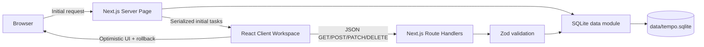

# Tempo Design Document

## 1. Product summary

Tempo is a focused task workspace for one person. Its job is not to model every possible project-management concept; it is to make capturing, clarifying, ordering, and finishing everyday work feel immediate. The application is deliberately account-free and local-first at the server level: one Next.js process owns one SQLite file.

### Goals

1. Let a user capture a thought in seconds and add structure only when it is useful.
2. Make the current workload understandable through time-based views, metadata, search, and progress.
3. Prevent common data-loss mistakes with durable writes, optimistic rollback, and deletion undo.
4. Work comfortably with mouse, touch, or keyboard from narrow mobile screens through large desktops.
5. Remain simple to run for coursework: no hosted database, credentials, or external APIs.

### Non-goals

Authentication, multiple users, shared workspaces, reminders, recurring tasks, subtasks, offline synchronization, and external calendar integration are intentionally excluded. They would introduce identity, scheduling, conflict-resolution, and delivery concerns that do not improve the selected core workflow.

## 2. Experience design

The interaction model uses progressive disclosure. The always-visible quick-add row asks only for a title. The editor reveals notes, priority, date, and tags. A task row presents the title first, then quiet metadata, with secondary actions shown on hover or keyboard focus. Completion remains a single click.

The information architecture has four stable views: active tasks, today, upcoming, and completed. Search crosses task titles, notes, and tags inside the active view. Sorting supports manual intent, time pressure, priority, and recency. Manual mode exposes drag handles; other modes disable reordering because a computed sort and manual order cannot both be visually true.

Visual language is warm and restrained: soft neutral surfaces, forest green for primary intent, chartreuse as a small identity accent, and semantic red only for destructive or overdue states. Typography, whitespace, low-noise borders, and modest elevation establish hierarchy without dashboard clutter.

### Responsive behavior

- At 881 px and wider, navigation is a fixed sidebar and the task canvas uses the remaining width.
- Below 881 px, the sidebar becomes an explicit Views drawer.
- Below 641 px, controls compress, task notes truncate, drag handles disappear in favor of touch-safe primary actions, and the editor becomes a single-column form.
- Content uses capped width and fluid horizontal padding to avoid both overly long lines and cramped cards.

### Accessibility

Every icon-only control has an accessible name. Native inputs, buttons, select elements, headings, landmarks, progress semantics, `aria-pressed`, and an `aria-live` status toast provide a robust baseline. Selection never depends on color alone. Focus rings are visible, drag ordering supports keyboard sensors, reduced-motion preferences disable ornamental animation, and both themes are included in automated axe checks.

## 3. System architecture

The server page reads SQLite directly and hands serializable tasks to one interactive client boundary. This avoids an unnecessary server-to-self HTTP request during rendering. After hydration, mutations use public Route Handlers. The native SQLite package is explicitly server-only and externalized from the Next.js bundle.

### Key boundaries

- `src/lib/db.ts`: schema creation, mapping, queries, transactions, seeding, health.
- `src/lib/validation.ts`: API input contracts and human validation messages.
- `src/app/api`: HTTP transport, status codes, error containment.
- `src/components/task-workspace.tsx`: view state, optimistic behavior, keyboard commands, server synchronization.
- `src/components/task-row.tsx`: sortable, selectable task presentation.
- `src/components/task-modal.tsx`: accessible detailed create/edit form.

## 4. Data design

The `tasks` table stores scalar task state and JSON-encoded tag strings. JSON is appropriate here because the app only needs set display and substring search in a small single-user dataset; normalized tag tables would add joins and referential operations without a present requirement.

| Field | Type | Constraint or meaning |
|---|---|---|
| `id` | INTEGER | Autoincrement primary key |
| `title` | TEXT | Required, 1–140 characters |
| `notes` | TEXT | Up to 1,000 characters at API boundary |
| `priority` | TEXT | `low`, `medium`, or `high` |
| `due_date` | TEXT/null | Local calendar date, `YYYY-MM-DD` |
| `tags` | TEXT | JSON string array, normalized lowercase |
| `completed` | INTEGER | Boolean check constraint |
| `position` | INTEGER | Manual ordering key |
| timestamps | TEXT/null | ISO 8601 audit values |

WAL journaling improves read/write concurrency, foreign-key enforcement is enabled for future evolution, and a five-second busy timeout handles brief contention. Reorders and bulk operations are transactions so partially applied visual states cannot persist.

## 5. API design

| Method and route | Purpose | Success |
|---|---|---|
| `GET /api/tasks` | Return ordered tasks | 200 |
| `POST /api/tasks` | Validate and create | 201 |
| `PATCH /api/tasks/:id` | Partial metadata or completion update | 200 |
| `DELETE /api/tasks/:id` | Delete and return prior representation | 200 |
| `POST /api/tasks/reorder` | Atomically persist an ID order | 200 |
| `POST /api/tasks/bulk` | Complete, reopen, or delete selected IDs | 200 |
| `GET /api/health` | SQLite integrity and readiness | 200/503 |

Malformed input returns 400, missing resources return 404, and contained server failures return a non-sensitive 500 message. Zod removes unknown object properties by default and bounds all user-controlled strings and arrays.

## 6. State and failure behavior

The server-rendered task snapshot eliminates an empty loading flash. Completion and deletion update the interface optimistically; on request failure the previous task is restored and a live status message explains the failure. Create/edit wait for server confirmation to obtain the canonical database row. A delete response supports a time-limited Undo action that recreates task content and completion state.

Filters, query, sort, selection, modal state, and theme are view concerns. Task content is server state held in the client after hydration. Theme preference alone uses `localStorage`; task truth never does. The initial theme script runs before paint to minimize flashes and honors the OS preference when no explicit choice exists.

## 7. Security and privacy

This is a trusted, local, single-user deployment and intentionally has no authorization boundary. Consequently it must not be exposed to an untrusted network as-is: any reachable client could mutate tasks. React escapes displayed content, the API uses parameterized SQL, Zod bounds payloads, and server errors do not reveal database details. A multi-user evolution would first add authentication, ownership columns, authorization on every query, CSRF/origin strategy, rate limits, and secure deployment headers.

## 8. Verification strategy

The verification pyramid is intentionally pragmatic:

1. Unit tests cover date stability and validation normalization/rejection.
2. ESLint and TypeScript catch static defects.
3. A production build catches server/client boundary and bundling errors.
4. Playwright drives installed Chrome through create, edit, search, complete, delete, and undo.
5. Desktop and Pixel-sized projects test responsive navigation and the editor.
6. Browser console and uncaught page errors are collected and asserted empty.
7. axe scans the normal workspace and modal for detectable accessibility violations.
8. Full-page screenshots provide reviewable visual artifacts.

## 9. Operational design

The app requires Node.js 22+, npm, and write access to its `data` directory. On first request, it creates the directory, schema, indexes, and sample tasks. `TODO_DB_PATH` can point to another SQLite file for testing or deployment, while `TODO_SKIP_SEED=1` suppresses sample data. Backups are ordinary copies of the SQLite database taken while the app is stopped, or performed with SQLite-aware backup tooling while live.

For one user on one persistent server, the current architecture is production-shaped and adequate. Serverless hosts with ephemeral filesystems are not compatible. A hosted deployment should use a persistent volume, or replace `db.ts` with a managed relational adapter while preserving the domain and API contracts.

## 10. Tradeoffs and evolution

The main tradeoff is concentrating workspace interactions in one client component. It keeps cross-cutting selection, keyboard, optimistic, and drag state understandable, but the file should be split into dedicated state hooks if features expand. Client-side filtering is instant and correct for a personal-sized list; pagination and server search become necessary for tens of thousands of rows. Undo recreates a record rather than preserving its numeric ID, which is harmless without foreign references but should become soft deletion or an event log before adding relationships.

Likely next increments are saved smart views, import/export, an activity history, and optional project grouping. Multi-user collaboration is a separate architectural phase, not a small feature toggle.
