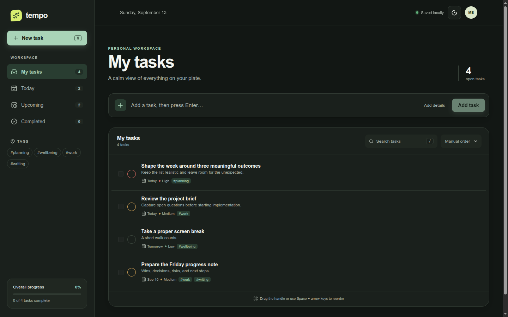
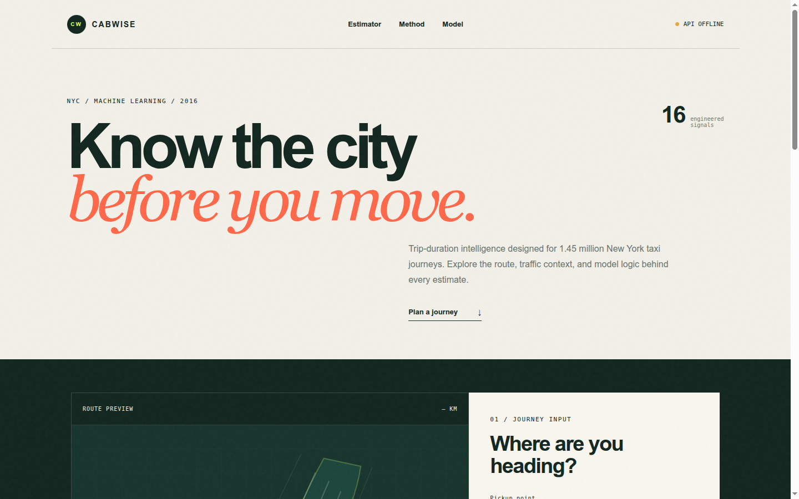
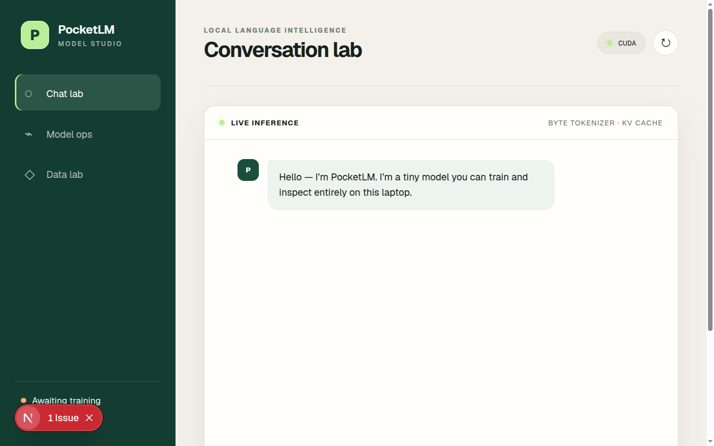
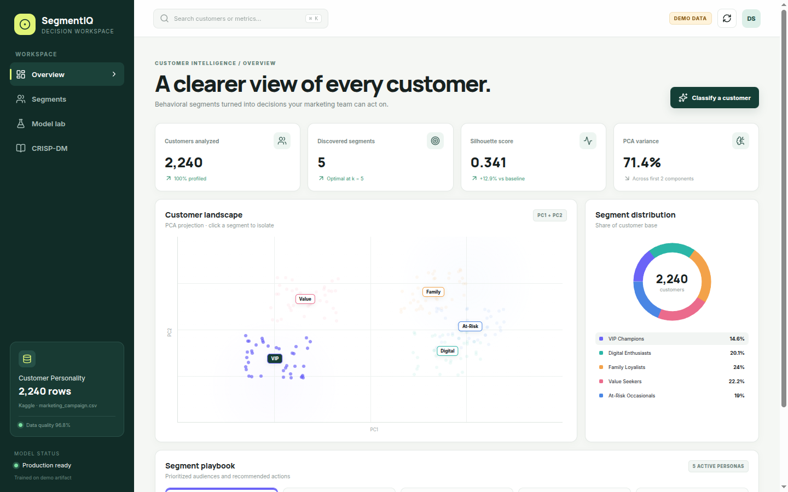
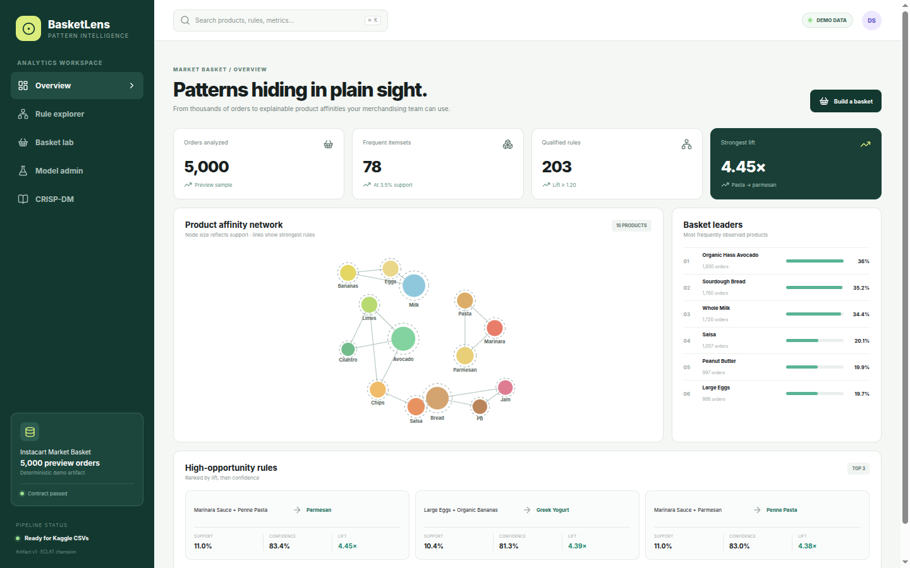
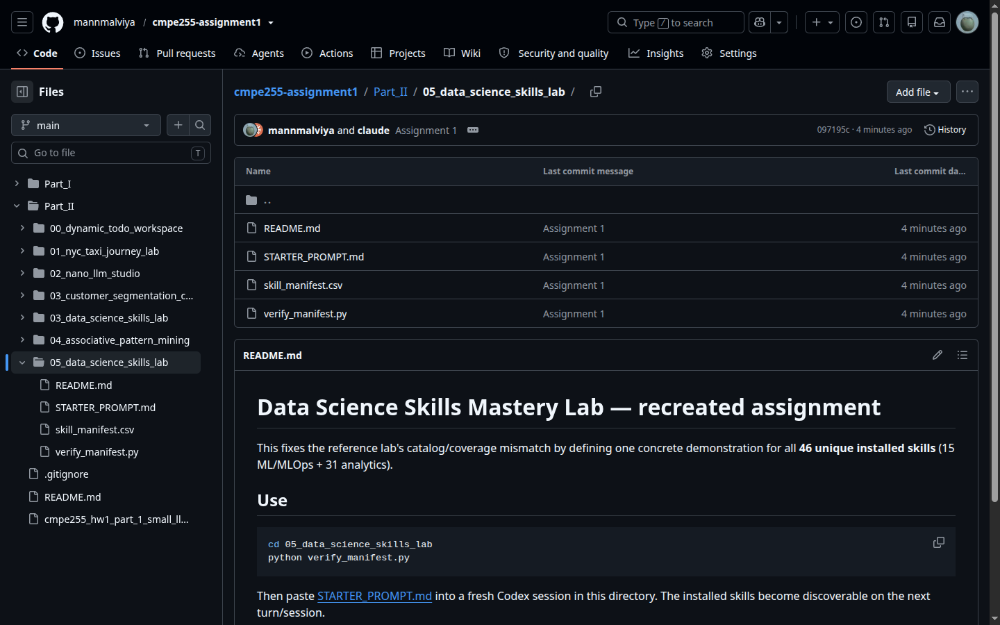

# Assignment 1

## Part I

YouTube video:
Medium Article: https://medium.com/@mann.malviya/small-language-models-versus-classical-machine-learning-for-sentiment-classification-860bb6caca3f
Code:

---

## Part II

YouTube Video:
Medium Article:
Code:

| # | System Title & Directory | Domain & Methodology | Backend Port | Frontend Port | Primary Screenshot Preview |
|---|---|---|:---:|:---:|:---:|
| **0** | [**Tempo Task Workspace**](./Part_II/00_dynamic_todo_workspace) | Full-Stack Next.js Task Workspace & SQLite Persistence | `—` | `3000` |  |
| **1** | [**Cabwise NYC Taxi Journey Lab**](./Part_II/01_nyc_taxi_journey_lab) | CRISP-DM Geospatial Trip-Duration Regression | `—` | `3000` |  |
| **2** | [**PocketLM Studio**](./Part_II/02_nano_llm_studio) | PyTorch Small Transformer LLM, Chatbot & Model Ops | `8000` | `3000` |  |
| **3** | [**SegmentIQ Customer Segmentation**](./Part_II/03_customer_segmentation_clustering) | K-Means / GMM / DBSCAN Clustering & PCA Personas | `8003` | `3001` |  |
| **4** | [**BasketLens Market Basket Mining**](./Part_II/04_associative_pattern_mining) | Apriori & ECLAT Association Rules | `8004` | `3004` |  |
| **5** | [**DS Skills Mastery Lab**](./Part_II/05_data_science_skills_lab) | 46 Agent Skills & 8 Kaggle Benchmarks | `—` | `—` |  |

---
